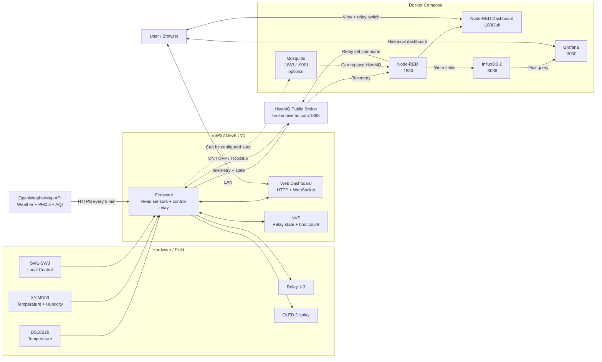
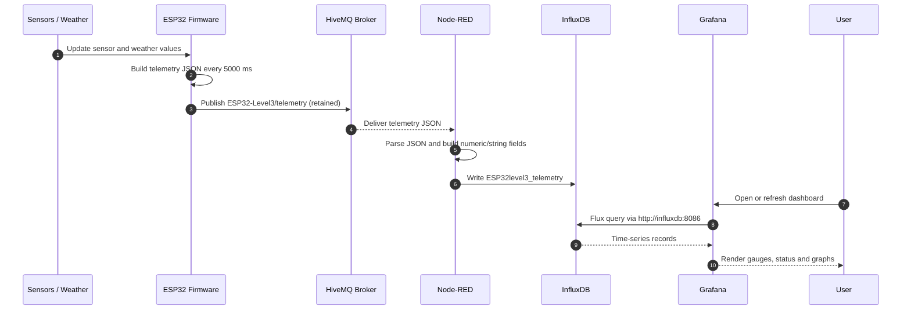
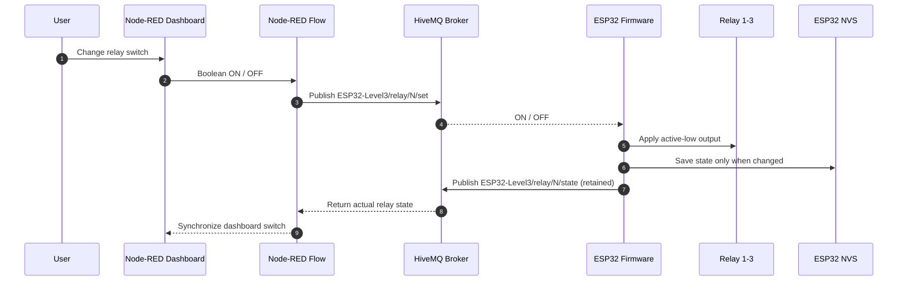
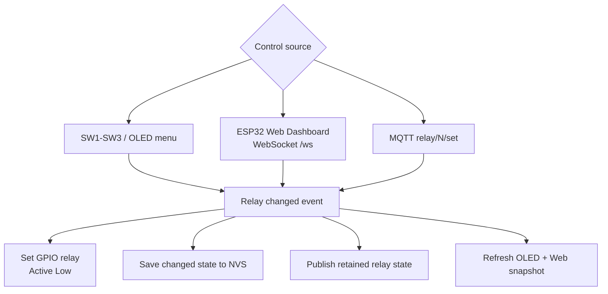
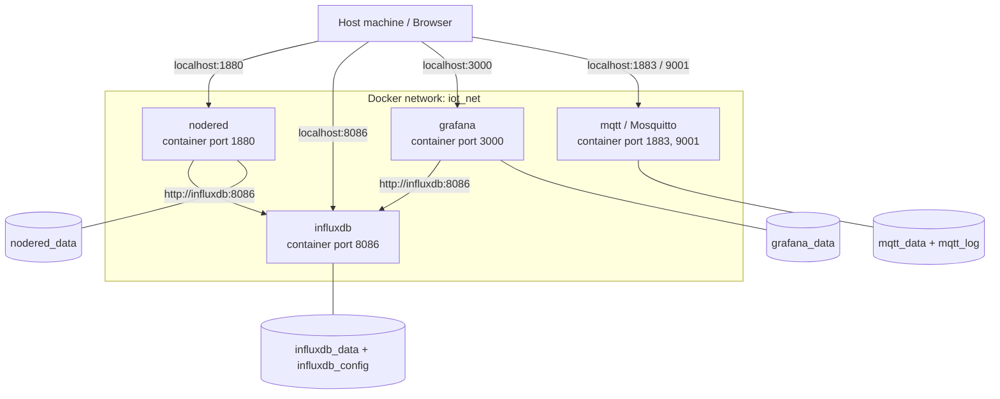
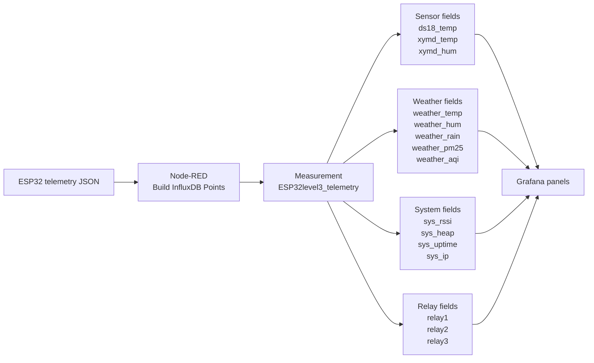

# ESP32_nodeRED_influxDB_grafana_Level3 — System Flow Diagram

เอกสารนี้อธิบายการเชื่อมโยงและทิศทางข้อมูลของระบบตั้งแต่ sensor บน ESP32 ไปจนถึง
Node-RED, InfluxDB และ Grafana รวมถึงทิศทางคำสั่งควบคุม relay ย้อนกลับมายัง ESP32

> Mermaid diagram แสดงได้โดยตรงบน GitHub และ VS Code ที่รองรับ Mermaid

## 1. ภาพรวมระบบ

เส้นทึบคือเส้นที่ระบบใช้งานอยู่ปัจจุบัน ส่วนเส้นประคือทางเลือกที่ยังต้องแก้ค่า
`MQTT_HOST` ใน firmware และ MQTT broker config ใน Node-RED ให้ตรงกันก่อนใช้ Mosquitto

## 2. Telemetry Flow: ESP32 → Grafana

จุดที่ต้องตรงกันตลอดเส้นทาง:

| ช่วง | ค่าที่ใช้ |
|---|---|
| ESP32 → MQTT | `ESP32-Level3/telemetry` |
| Node-RED → InfluxDB | Organization `mylab`, bucket `esp32_db` |
| InfluxDB measurement | `ESP32level3_telemetry` |
| Grafana → InfluxDB | `http://influxdb:8086` จากภายใน container |
| Grafana Data Source | Flux + token ที่มีสิทธิ์อ่าน `esp32_db` |

## 3. Relay Control Flow: Node-RED → ESP32

คำสั่ง MQTT ที่ firmware รองรับคือ `ON`, `OFF` และ `TOGGLE` โดยแทน `N` ด้วย `1`, `2` หรือ `3`

## 4. Local Control Flow บน ESP32

ไม่ว่าจะสั่ง relay จากปุ่ม, ESP32 Web Dashboard หรือ MQTT ผลลัพธ์จะถูกส่งเข้าเส้นทาง
อัปเดตเดียวกัน ทำให้ GPIO, NVS, OLED, Web Dashboard และ MQTT state สอดคล้องกัน

## 5. Docker Services และ Network

`localhost` ใช้เมื่อเข้าบริการจาก browser บนเครื่อง host แต่ container ที่คุยกันต้องใช้ Docker service name
เช่น `http://influxdb:8086` ไม่ใช่ `http://localhost:8086`

## 6. InfluxDB Field Mapping

Grafana Time series ควรใช้ `aggregateWindow(every: v.windowPeriod, ...)` ส่วน panel ค่าปัจจุบันหรือสถานะ
ควรใช้ `last()` เพื่อลดจำนวน record ที่ส่งกลับมา

## 7. จุดตรวจเมื่อข้อมูลขาดช่วง

| อาการ | จุดที่ควรตรวจตามลำดับ |
|---|---|
| Node-RED ไม่มี telemetry | ESP32 WiFi → HiveMQ → topic `ESP32-Level3/telemetry` → MQTT input node |
| InfluxDB ไม่มีข้อมูล | Node-RED flow deployed → URL `http://influxdb:8086` → write token → org/bucket/measurement |
| Grafana ขึ้น `No data` | InfluxDB Data Explorer → Grafana Data Source → read token → Flux field → dashboard time range |
| สั่ง relay ไม่ทำงาน | Node-RED switch → `relay/N/set` → HiveMQ → ESP32 subscription → GPIO |
| Dashboard แสดงสถานะ relay ไม่ตรง | `relay/N/state` retained → Node-RED state input → UI switch synchronization |

## 8. ไฟล์ที่รับผิดชอบแต่ละจุด

| ส่วนของระบบ | ไฟล์หลัก |
|---|---|
| Firmware orchestration | `esp32_firmware/src/main.cpp` |
| MQTT telemetry/control | `esp32_firmware/include/DevMQTT.h` |
| MQTT/API configuration | `esp32_firmware/include/config.h`, `config_private.h` |
| ESP32 local web | `esp32_firmware/include/DevWebServer.h`, `dashboard.h` |
| Node-RED flow | `nodered/flows/esp32_level3_dashboard.json` |
| Docker services/network/volumes | `docker-compose.yml`, `.env` |
| Grafana dashboard | `grafana/dashboards/grafana-dashboard-esp32.json` |
| Grafana Flux examples | `GRAFANA_QUERY_GUIDE.md` |

## หมายเหตุเรื่อง MQTT Broker

ปัจจุบัน firmware และ Node-RED flow ใช้ `broker.hivemq.com:1883` ทั้งคู่ ดังนั้น Mosquitto service ใน
`docker-compose.yml` ยังไม่ได้อยู่ใน data path หลัก หากจะย้ายมาใช้ local Mosquitto ต้องแก้ broker
ทั้งใน firmware และ Node-RED พร้อมกัน และ ESP32 ต้องเข้าถึง IP ของเครื่อง Docker ได้
